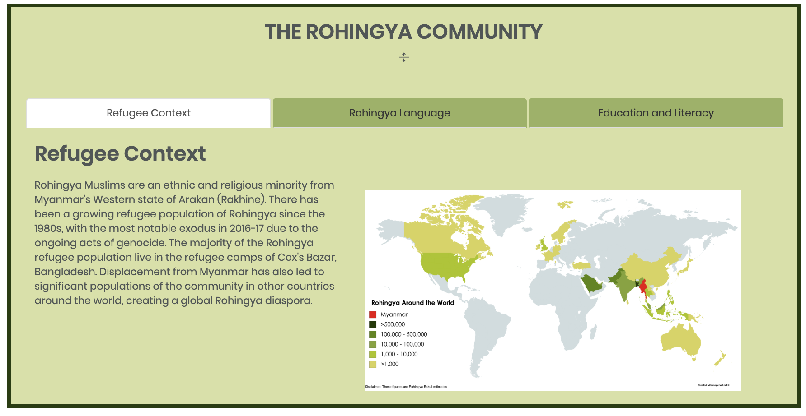
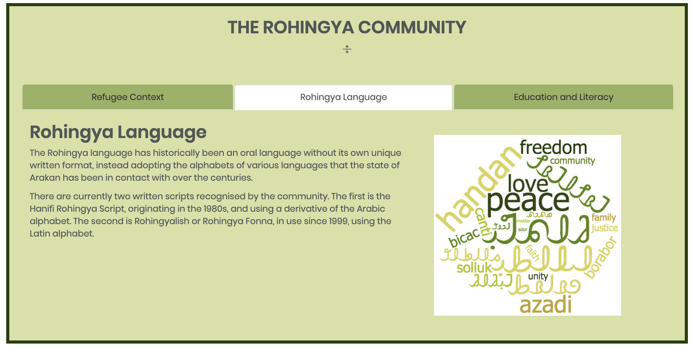
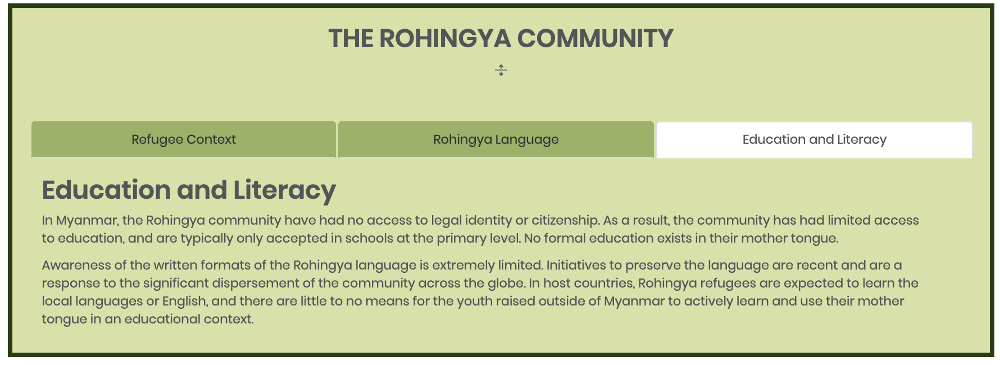

# rohingyaeskul.org
Rohingya Eskul is an ed-tech initiative founded on the belief in equal rights and opportunity. Our projects are designed specifically for the marginalised Rohingya communities; to be a part of the empowerment of youth in their cultural identity, the preservation of a valuable language, and the improvement of refugee access to education.

## About Eskul

## Eskul's Current Projects

## Educational Resources

## Co-Founding Members

